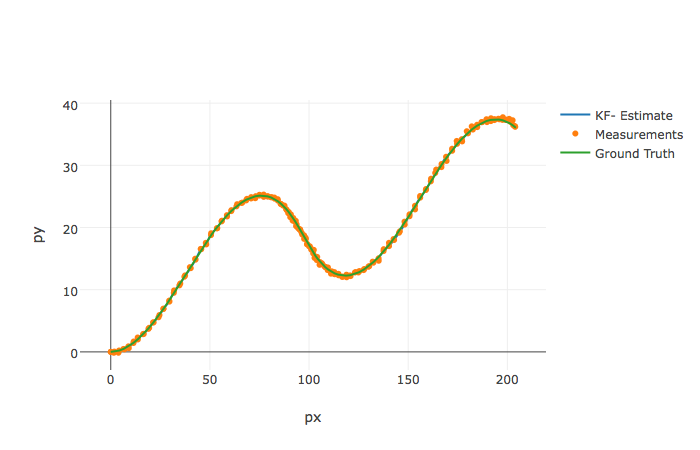
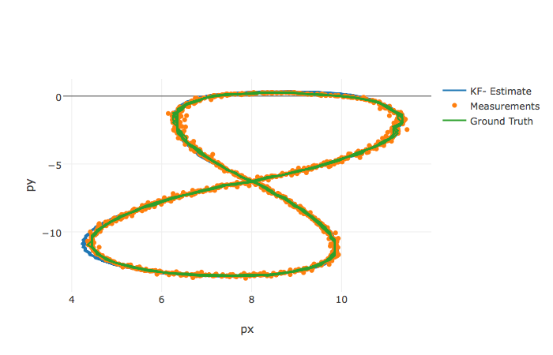

# Extended Kalman Filter Project

Self-Driving Car Engineer Nanodegree Program
## Basic Build Instructions

- Clone this repo.
- Make a build directory: `mkdir build && cd build`
- Compile: `cmake .. && make`
    On windows, you may need to run: cmake .. -G "Unix Makefiles" && make
 - Run it: `./ExtendedKF path/to/input.txt path/to/output.txt`. You can find some sample inputs in `data/`.
    eg. ./ExtendedKF ../data/sample-laser-radar-measurement-data-1.txt output-1.txt


```bash
cd build && cmake .. && make
```
    -- Configuring done
    -- Generating done
    -- Build files have been written to: /Users/ab/SDC/CarND-Extended-Kalman-Filter-Project-master/build
    Scanning dependencies of target ExtendedKF
    [ 20%] Building CXX object CMakeFiles/ExtendedKF.dir/src/tools.cpp.o
    [ 40%] Linking CXX executable ExtendedKF
    [100%] Built target ExtendedKF


## Execution and Visualization


```python
import plotly.offline as py
from plotly.graph_objs import *
import pandas as pd
import math
py.init_notebook_mode()

my_cols=['px_est','py_est','vx_est','vy_est','px_meas','py_meas','px_gt','py_gt','vx_gt','vy_gt']

def plot(table_ekf_output):
    #estimations
    trace1 = Scatter(x=table_ekf_output['px_est'],y=table_ekf_output['py_est'],xaxis='x2',yaxis='y2',name='KF- Estimate')
    #Measurements
    trace2 = Scatter(x=table_ekf_output['px_meas'],y=table_ekf_output['py_meas'],xaxis='x2',yaxis='y2',name = 'Measurements',mode = 'markers')
    #Measurements
    trace3 = Scatter(x=table_ekf_output['px_gt'],y=table_ekf_output['py_gt'],xaxis='x2',yaxis='y2',name = 'Ground Truth')
    data = [trace1, trace2, trace3]
    layout = Layout(xaxis2=dict(anchor='x2',title='px'), yaxis2=dict(anchor='y2',title='py'))
    fig = Figure(data=data, layout=layout)
    py.iplot(fig, filename= 'EKF')
```

```bash
DIR=/Users/ab/SDC/CarND-Extended-Kalman-Filter-Project-master/
$DIR/build/ExtendedKF $DIR/data/sample-laser-radar-measurement-data-1.txt $DIR/data/output-1.txt
```
    Accuracy - RMSE:
    0.0651649
    0.0605378
      0.54319
     0.544191


```python
plot(pd.read_table('data/output-1.txt', sep='\t', header=None, names=my_cols, lineterminator='\n'))
```

```python
%%bash
DIR=/Users/ab/SDC/CarND-Extended-Kalman-Filter-Project-master/
$DIR/build/ExtendedKF $DIR/data/sample-laser-radar-measurement-data-2.txt $DIR/data/output-2.txt
```
    CalculateJacobian () - Error - Division by Zero
    Accuracy - RMSE:
    0.186287
    0.190262
    0.478778
     0.80831
```python
plot(pd.read_table('data/output-2.txt', sep='\t', header=None, names=my_cols, lineterminator='\n'))
```

